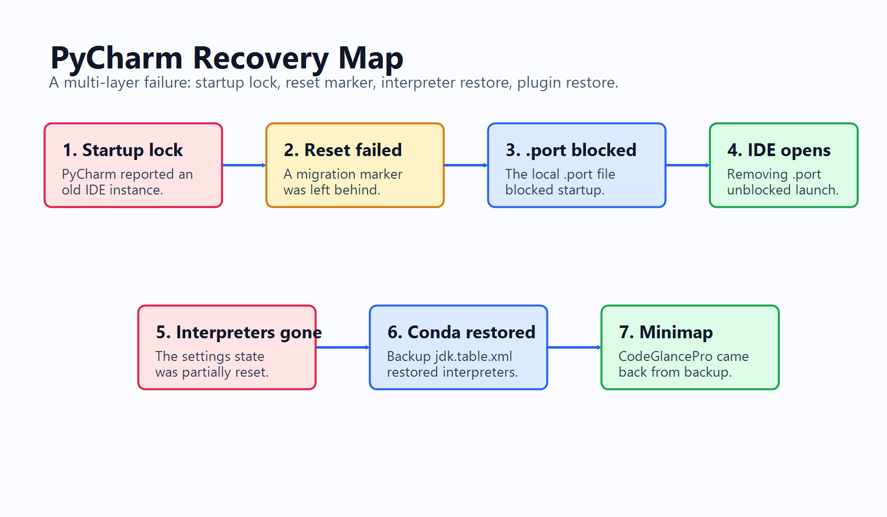
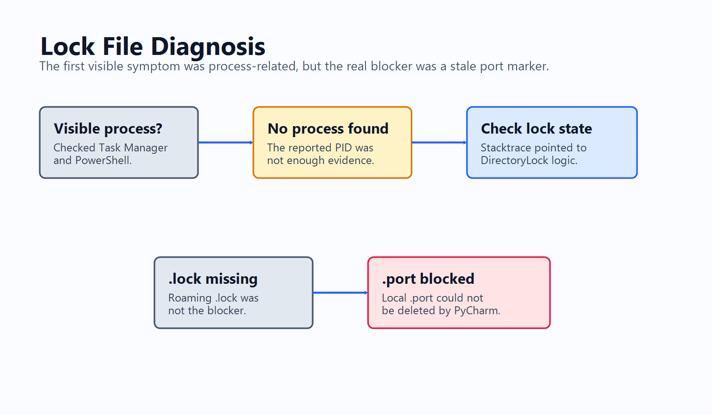
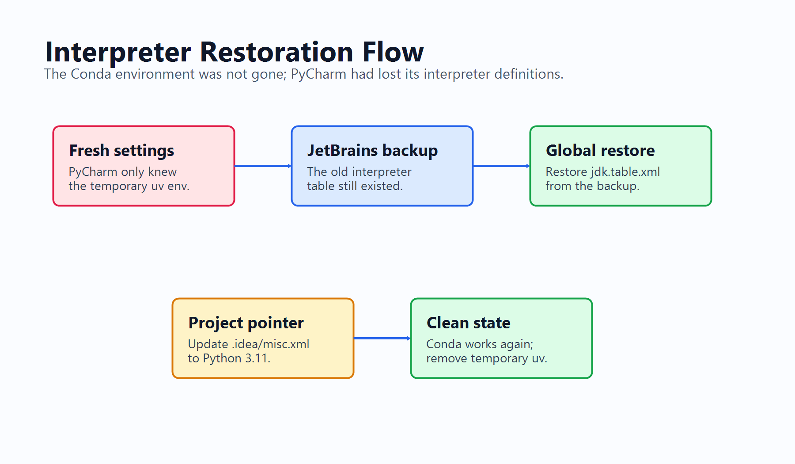

# Debugging PyCharm Startup Locks, Missing Conda Interpreters, and a Vanished CodeGlancePro Minimap on Windows

## Alternate Titles

1. When PyCharm Would Not Start: Fixing `.port`, Restoring Conda, and Recovering CodeGlancePro
2. PyCharm Said Another Instance Was Running. The Real Problem Was a Stale `.port` File
3. Recovering PyCharm on Windows After Startup Locks, Lost Interpreters, and Missing Plugins
4. How I Restored PyCharm Without Reinstalling: DirectoryLock, `jdk.table.xml`, and CodeGlancePro
5. The PyCharm Recovery Trail: From `CannotActivateException` to a Restored Conda Interpreter
6. Debugging a Broken PyCharm Configuration: Lock Files, Backups, and the Missing Minimap

## SEO

**Meta description:** A chronological Windows PyCharm recovery story covering `DirectoryLock$CannotActivateException`, stale `.port` files, `migrate.config`, missing Conda interpreters, `jdk.table.xml`, `.idea\misc.xml`, and CodeGlancePro restoration.

**Suggested slug:** `pycharm-windows-startup-lock-conda-codeglancepro-recovery`

**Primary keyword:** PyCharm startup lock Windows

**Secondary keywords:** `DirectoryLock$CannotActivateException`, PyCharm `.port` file, PyCharm missing Conda interpreter, `jdk.table.xml`, CodeGlancePro minimap, JetBrains backup restore

## Opening

PyCharm did not break in one clean way. It failed in layers.

At first, it looked like a normal startup issue: PyCharm claimed another instance was still running. Once that was fixed, a second problem appeared: every configured Python interpreter had disappeared. After I restored the interpreters, a third issue surfaced: the editor minimap beside the right scrollbar was gone.

That sequence mattered. If I had treated all three symptoms as one problem, I probably would have reinstalled PyCharm, recreated environments, and lost time rebuilding a setup that mostly still existed. The real recovery came from separating the lock problem from the interpreter problem, then separating both of those from the missing CodeGlancePro plugin state.

## Background



The first error looked authoritative:

```text
Internal error

com.intellij.platform.ide.bootstrap.DirectoryLock$CannotActivateException:
Process "C:\Program Files (x86)\JetBrains\PyCharm Community Edition 2022.3.2\bin\pycharm64.exe" (48464) is still running and does not respond.
```

My first theory was the obvious one:

```text
Maybe pycharm64.exe is really still alive and stuck.
```

So I checked from PowerShell:

```powershell
Get-Process -Name pycharm64 -ErrorAction SilentlyContinue |
  Select-Object Id, ProcessName, Path, StartTime, Responding
```

I also searched for PyCharm in Windows Task Manager, expecting to find a stuck process or a hidden window. I could not find a visible PyCharm process.

That changed how I read the error. The process ID `48464` in the message was useful, but it did not prove that a live IDE window was still the blocker. JetBrains IDEs use marker files to coordinate whether another IDE instance owns a configuration or system directory. Those markers can survive after the process that created them is gone.

So the first important decision was to stop thinking only in terms of killing `pycharm64.exe`. There was probably stale startup state somewhere in the JetBrains settings directories.

The next recovery attempt made the situation clearer, but not cleaner. Trying to reset settings produced this error:

```text
Cannot write the reset marker file.

The cause: java.lang.AssertionError:
Marker file %APPDATA%\JetBrains\PyCharm2026.1\migrate.config shouldn't exist
```

That sounded like a settings migration or reset flow had begun and left behind a marker file:

```text
The settings migration or reset flow had started, but left behind a marker file.
```

After making sure PyCharm was closed, I removed that marker:

```powershell
Remove-Item -LiteralPath `
  "$env:APPDATA\JetBrains\PyCharm2026.1\migrate.config" `
  -Force
```

This fixed one layer of the problem, but not the whole startup failure. That distinction became important later: `%APPDATA%\JetBrains\PyCharm2026.1\migrate.config` explained why the reset flow was dirty. It was not the root cause of the startup lock.

The useful clue came from the next error:

```text
java.nio.file.FileSystemException:
%LOCALAPPDATA%\JetBrains\PyCharm2026.1\.port:
The system cannot access the file.
```

The stacktrace included:

```text
Files.deleteIfExists
DirectoryLock.lockOrActivate
```

That told me PyCharm was trying to delete `.port` during startup lock negotiation, and Windows was refusing access. Now the startup blocker had a concrete file:

```text
%LOCALAPPDATA%\JetBrains\PyCharm2026.1\.port
```

I checked the local `.port` file and the roaming `.lock` file:

```powershell
Get-Item -LiteralPath `
  "$env:LOCALAPPDATA\JetBrains\PyCharm2026.1\.port" `
  -Force

Test-Path -LiteralPath `
  "$env:APPDATA\JetBrains\PyCharm2026.1\.lock"
```

The stacktrace also reported:

```text
NoSuchFileException:
%APPDATA%\JetBrains\PyCharm2026.1\.lock
```

That gave me the second root-cause distinction. `.lock` was not the live blocker; `.port` was. The reset marker had been a recovery-state symptom, and `.lock` was reported missing, but `.port` was the file PyCharm could not access during startup.

## Debug Process

The startup fix was simple once the distinction was clear:

```powershell
Remove-Item -LiteralPath `
  "$env:LOCALAPPDATA\JetBrains\PyCharm2026.1\.port" `
  -Force
```

After removing `.port`, PyCharm finally opened.



But opening the IDE uncovered the next failure. Every Python interpreter was gone.

PyCharm prompted me to create:

```text
uv (example-project)
```

That interpreter was only a temporary response to the broken configuration. It was not the environment I needed. The original project used Conda, likely Python 3.11. So I treated `uv (example-project)` as evidence of a newly generated settings state, not as the real fix.

The new theory was:

```text
PyCharm recovered by creating a fresh settings state, while the old interpreter definitions were still in a JetBrains backup.
```

That turned out to be right. JetBrains had left a backup directory:

```text
%APPDATA%\JetBrains\PyCharm2026.1-backup\2026-06-23-14-08
```

The global interpreter definitions live in:

```text
options\jdk.table.xml
```

I compared the current file with the backup:

```powershell
Get-Content -Raw `
  "$env:APPDATA\JetBrains\PyCharm2026.1\options\jdk.table.xml"

Get-Content -Raw `
  "$env:APPDATA\JetBrains\PyCharm2026.1-backup\2026-06-23-14-08\options\jdk.table.xml"
```

The current file mainly contained the newly created `uv` interpreter. The backup still contained the original interpreters, including:

```text
Python 3.7 (python37)
Conda(python311)
Conda(MaskRCNN_TF2_Python3613)
Python 3.11
```

So I restored the backup `jdk.table.xml`:

```powershell
Copy-Item `
  -LiteralPath "$env:APPDATA\JetBrains\PyCharm2026.1-backup\2026-06-23-14-08\options\jdk.table.xml" `
  -Destination "$env:APPDATA\JetBrains\PyCharm2026.1\options\jdk.table.xml" `
  -Force
```

That restored the global interpreter list, but it did not finish the recovery. A project can still point to the wrong interpreter even after PyCharm knows about the right ones globally.

The project-level selection was in:

```text
<project-root>\.idea\misc.xml
```

It had been changed to:

```xml
project-jdk-name="uv (example-project)"
```

I changed it back to:

```xml
project-jdk-name="Python 3.11"
```

The restored interpreter pointed to:

```text
<conda-install>\python.exe
Python 3.11.13
```

That was the third major distinction: `jdk.table.xml` controls what PyCharm knows globally, while `.idea\misc.xml` controls what this project actually uses. Restoring one without checking the other can leave the IDE looking fixed while the project still runs under the wrong interpreter.



Once the Conda interpreter was back, the temporary interpreter was no longer useful:

```text
uv (example-project)
```

I removed that entry from `jdk.table.xml`, but only after restoring and verifying the Conda interpreter. The order mattered. Removing `uv` first could have pushed PyCharm back into another forced environment creation prompt. Restoring the real interpreter first gave the project a stable target before the temporary one was cleaned out.

At this point, startup worked and the project interpreter was back. Then I noticed the editor still did not look right. The code minimap beside the right scrollbar had disappeared.

That minimap was not a built-in PyCharm feature in this setup. It came from:

```text
CodeGlancePro
```

So the next theory was:

```text
The settings reset did not only affect interpreters. It also affected plugins and plugin options.
```

The backup contained both the plugin and its settings:

```text
...\PyCharm2026.1-backup\2026-06-23-14-08\plugins\CodeGlancePro
...\PyCharm2026.1-backup\2026-06-23-14-08\options\CodeGlancePro.xml
```

I restored the plugin directory:

```powershell
Copy-Item `
  -LiteralPath "...\PyCharm2026.1-backup\2026-06-23-14-08\plugins\CodeGlancePro" `
  -Destination "$env:APPDATA\JetBrains\PyCharm2026.1\plugins\CodeGlancePro" `
  -Recurse `
  -Force
```

Then I restored the plugin options:

```powershell
Copy-Item `
  -LiteralPath "...\PyCharm2026.1-backup\2026-06-23-14-08\options\CodeGlancePro.xml" `
  -Destination "$env:APPDATA\JetBrains\PyCharm2026.1\options\CodeGlancePro.xml" `
  -Force
```

I also checked `disabled_plugins.txt` to make sure CodeGlancePro was not listed as disabled. After restarting PyCharm, the minimap appeared again.

Then the `.port` error returned once more:

```text
%LOCALAPPDATA%\JetBrains\PyCharm2026.1\.port:
The system cannot access the file.
```

That confirmed `.port` was not just a cosmetic startup message. It was part of PyCharm's lock state and could be recreated or left behind during a failed launch. The same fix worked again:

```powershell
Remove-Item -LiteralPath `
  "$env:LOCALAPPDATA\JetBrains\PyCharm2026.1\.port" `
  -Force
```

After that, PyCharm opened normally with the restored interpreter and CodeGlancePro enabled.

Looking back, the tempting shortcut would have been to treat the IDE as corrupted and start over. That would have hidden the actual failure boundaries. The Conda installation had not disappeared. The project files were not the source of the startup lock. CodeGlancePro had not become a PyCharm feature that suddenly vanished; it was still a plugin with a folder and an options file that had to be restored from the same backup family as the interpreter definitions.

The safest pattern was to make one change, restart, and observe the next symptom. Removing `migrate.config` answered the reset problem. Removing `.port` answered the startup problem. Restoring `jdk.table.xml` answered the global interpreter problem. Editing `.idea\misc.xml` answered the project interpreter problem. Restoring CodeGlancePro answered the minimap problem. When `.port` returned, it was not new evidence against the interpreter or plugin fixes; it was the same startup-lock layer reappearing after another failed launch.

## Solution

The sequence that actually worked was not dramatic:

1. Do not reinstall PyCharm immediately.
2. Check whether `pycharm64.exe` or the reported PID is still running.
3. Remove the stale `migrate.config` marker.
4. Treat `.port` as the real startup lock blocker.
5. Remove `Local\JetBrains\PyCharm2026.1\.port`.
6. Start PyCharm and confirm it opens.
7. Restore `jdk.table.xml` from the JetBrains backup.
8. Point `.idea\misc.xml` back to the Conda/Python 3.11 interpreter.
9. Remove the temporary `uv (example-project)` interpreter.
10. Restore CodeGlancePro and its options from the backup.
11. If `.port` returns after another failed launch, remove it again after PyCharm is closed.

The recovered setup ended in this state:

```text
PyCharm opens successfully
Project interpreter: Python 3.11 / Conda
Conda path: <conda-install>\python.exe
Temporary uv interpreter removed
CodeGlancePro restored
Editor minimap visible again
Stale .port startup lock cleared
```

## Lessons Learned and Pitfalls

The practical lesson is that IDE recovery is not only about deleting caches or reinstalling the application. In this case, each layer had a different meaning. `DirectoryLock$CannotActivateException` did not prove there was a visible process to kill. `migrate.config` showed a dirty reset state, but `.port` was the live startup blocker. The missing interpreters were not missing Conda environments; PyCharm had lost its global interpreter definitions. The missing minimap was not a removed IDE feature; it was CodeGlancePro and its options missing from the restored settings.

## Conclusion

The fix came from respecting those boundaries and restoring only the pieces that matched the symptom.

## Tags

PyCharm, JetBrains, Windows, Python, Conda, Debugging, PowerShell, CodeGlancePro, Developer Tools, IDE Recovery
